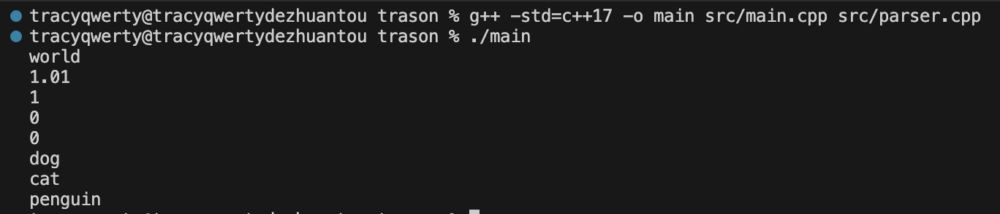
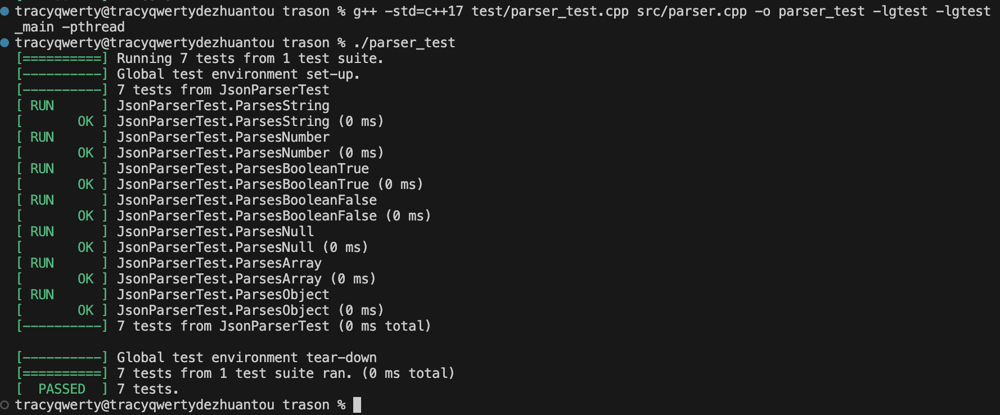

# trason
A toy json parser using modern cpp.

# usage

to run single test, type

```bash
g++ -std=c++17 -o main src/main.cpp src/parser.cpp
```

in terminal.



to run google test, type

```bash
g++ -std=c++17 test/parser_test.cpp src/parser.cpp -o parser_test -lgtest -lgtest_main -pthread
```



# reference

https://stackoverflow.com/questions/51622016/how-to-delete-a-string-object-which-is-a-member-variable-of-a-c-union

https://github.com/Civitasv/mini-json-parser/

https://zhuanlan.zhihu.com/p/28049617
